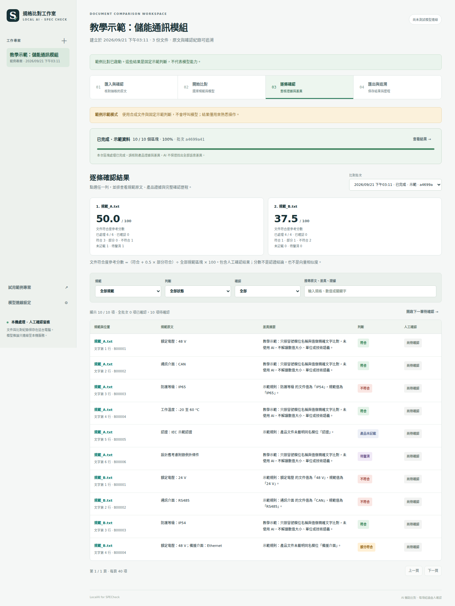

# LocalAIforSPECheck｜本機產品規格比對與人工覆核

把一份產品規格，與多份技術規範逐段比對；查看各規範的文件符合度、差異、產品原文證據，並記錄同仁的覆核結果。文件與運算資料留在本機。Windows Portable 版內附 Python、模型服務及入門模型，解壓縮後即可使用；原始碼版也可連接 LM Studio 或相容本機服務。

適合用於規格初篩、供應商文件比較、設計差異清單與覆核交接。**AI 的輸出是待確認的比對建議，不能取代工程師簽核，也不保證找出所有原子條件的差異。**



[人工覆核畫面](docs/screenshots/review.png) · [合成示範 HTML 報告（下載後以瀏覽器開啟）](examples/demo_report.html) · [開發驗證紀錄](docs/TEST_REPORT.md)

## Windows：下載完整免安裝版

[**下載 Windows x64 Portable 完整 ZIP**](https://github.com/pcpcchen-coder/LocalAIforSPECheck/releases/latest/download/LocalAIforSPECheck-Windows-x64.zip) · [版本、檢查碼與發佈內容](https://github.com/pcpcchen-coder/LocalAIforSPECheck/releases) · [完整操作步驟與排錯](docs/WINDOWS_PORTABLE.md)

請下載 Release 中的 **`LocalAIforSPECheck-Windows-x64.zip`**，不要下載 GitHub 的 `Source code (zip)` 或綠色 Code 按鈕中的 ZIP。原始碼 ZIP 不含執行環境或模型。

1. 在 Windows 10／11 **64 位元 x64** 電腦，將 ZIP「全部解壓縮」到自己可寫入的資料夾，例如「文件」中的 `規格比對工具`。不要直接在 ZIP 裡雙擊執行。
2. 進入解壓後的資料夾，雙擊 **`Start.bat`**。等待內附模型載入，瀏覽器會自動開啟；啟動視窗請保持開啟。
3. 第一次先使用介面的範例示範，熟悉操作。接著建立自己的專案，上傳一份產品文件與一份以上規範，逐份預覽並確認原文。
4. 按「開始本機模型比對」，查看排序、差異及產品原文；逐筆確認或修正判定，留下姓名與說明。
5. 在「匯出與追溯」下載 HTML／Excel／JSON。完成後先停止或等待比對結束，再雙擊 **`Stop.bat`**。

**完整 ZIP 內附 Qwen3.5-2B Q6_K、CPU 模型服務、Python 與所需套件，不需要安裝 Python、LM Studio、Bionic 或顯示卡驅動，啟動及比對時不需要網路。** 初次下載 ZIP 需要網路。內附 2B 模型供操作驗證與初篩；複雜技術條款建議改用較大模型並依實際文件驗收，全部結論仍需人工覆核。模型選擇見 [MODELS.md](docs/MODELS.md)。

可攜版不安裝 Windows 服務，不修改系統 PATH 或登錄設定，也不需要管理員權限。若公司政策禁止執行外來 EXE，仍須由 IT 核准；本工具不繞過端點管制。

macOS／Linux 或需要自行管理模型服務者，使用下方原始碼安裝方式。

## 功能範圍

| 功能 | 行為 |
|---|---|
| 文件輸入 | 有文字層的 PDF、DOCX、XLSX、CSV、TXT／Markdown；保留原始文件與擷取位置 |
| 解析確認 | 顯示文字區塊與解析提醒；使用者確認後才能開始正式比對 |
| 多規範排序 | 每份規範顯示「文件符合度參考分數」、各類狀態及覆核進度 |
| 全文比對 | 每個規範文字區塊會檢查全部產品文字視窗，不只取檢索前幾筆 |
| 差異明細 | 原要求、狀態、差異清單、說明、原文引述、文件位置、模型自評信心（非經校準準確率）及警告 |
| 人工覆核 | 確認、更正、重新開啟；保留覆核者、自填意見、時間、版本與歷次事件 |
| 進度保留 | 已完成列持久化；取消／中斷後可續跑；新比對另建一份結果 |
| 匯出 | HTML 可讀報告、XLSX 工作簿、JSON 完整紀錄；包含尚未覆核項目，保留歷次輸出及 SHA-256 |
| 本機資料 | SQLite＋原始文件；不使用 CDN、遙測或雲端模型 API |

功能與格式的精確限制見 [操作指南](docs/USER_GUIDE.md)；模型與 LM Studio／Bionic 設定見 [模型選擇與部署](docs/MODELS.md)。

## 進階：原始碼安裝與既有模型服務

需要 Python **3.11 以上**、可用瀏覽器、足夠磁碟空間，以及能執行所選模型的電腦。模型主機必須在同一部電腦；此版本只接受 loopback API 位址。

此方式不適用於「解壓即可使用」的需求；Windows 一般同仁請使用上方 Portable 版。開發者可從 GitHub 下載原始碼並完整解壓縮，或使用 Git：

```bash
git clone https://github.com/pcpcchen-coder/LocalAIforSPECheck.git
cd LocalAIforSPECheck
```

Windows（命令提示字元）：

```bat
py -3 -m venv .venv
.venv\Scripts\python.exe -m pip install --upgrade pip
.venv\Scripts\python.exe -m pip install -r requirements.txt
.venv\Scripts\python.exe launcher.py
```

macOS／Linux：

```bash
python3 -m venv .venv
.venv/bin/python -m pip install --upgrade pip
.venv/bin/python -m pip install -r requirements.txt
chmod +x start_macos.command start_linux.sh
.venv/bin/python launcher.py
```

若系統有多個 Python，先以 `python --version` 或 `python3 --version` 確認實際版本。macOS 的系統 Python 不一定符合要求。首次下載 Python 套件、模型需要網路；完成安裝且模型已下載後，本機比對不需要對外連線。公司設備不能安裝軟體時，可使用已內附環境與模型的 Windows Portable ZIP；仍須符合公司對可執行檔的使用政策。

LM Studio 預設連線欄位為 `http://127.0.0.1:1234/v1`；請依實際 Server 畫面核對。**Bionic 不預設端口**，必須使用該工具實際顯示且支援 OpenAI 相容介面的 loopback URL。模型 ID 必須與 `/v1/models` 回傳一致。請先測試連線，再存設定並執行。

### 手動啟動與特殊端口

在已啟用虛擬環境的終端機執行：

```bash
python launcher.py
python launcher.py --no-browser
python launcher.py --port 8766
```

也可由 IT 直接執行：

```bash
python -m uvicorn spec_check.app:app --host 127.0.0.1 --port 8765 --workers 1
```

請維持 `127.0.0.1` 與單一 worker；不要使用 `--reload`，也不要把此版本公開到區域網路或網際網路。

## 分數與狀態怎麼解讀

| 狀態 | 含義 |
|---|---|
| 符合 `match` | AI 依產品文字與有效引述判定符合；仍需人工確認 |
| 部分符合 `partial` | 部分條件符合，仍有差異或限制 |
| 不符合 `mismatch` | 產品文件有可引述的內容，與要求存在衝突 |
| 文件未載明 `missing` | 所有產品視窗均已檢查，仍找不到支援資訊；不代表實際產品必定不合規 |
| 待確認 `uncertain` | 證據不足、輸出無法驗證、連線失敗或其他無法可靠判定情況 |

文件符合度參考分數：`100 ×（符合數＋0.5 × 部分符合數）／規範文字區塊總數`。所有狀態均計入分母；確認／更正後採人工最終狀態計分。它是可解釋的工作排序指標，**不是認證結論，也不是向量語意相似度**。不同規範的篇幅、切段方式、條件數與重要程度會影響分數，不能僅憑最高分選定標準。未完成或中斷的比對，只能視為暫時結果。

## 已知限制

- **沒有內建 OCR。** 掃描 PDF、截圖、圖片表格、DOCX 圖片及 XLSX 圖片，應先由核准工具轉成文字並人工校核。讀不到文字時不能當成沒有要求。
- 文件中圖面、公差圖、跨頁表格、頁首頁尾、合併儲存格、註脚與公式可能失去原本關係；擷取預覽是必要步驟。
- 一個區塊可能含多個要求。完整處理所有區塊不等於保證每個原子條件都判對；重要規範應再人工逐條拆解及抽核。
- 本工具會驗證引述文字是否存在於產品文件；「引述存在」並不證明模型推理正確。單位換算、條件例外、測試方法與跨段引用仍可能判錯。
- 覆核者姓名是自填，沒有帳號驗證或數位簽章；事件歷史用於追溯，不是不可竄改的稽核憑證。
- 大文件採逐區塊、逐產品視窗循序呼叫，耗時可能很長。此版本無多人伺服器權限與排程叢集。
- 合成示範與自動測試只能驗證系統流程；**沒有以你的真實文件及本地模型完成驗收前，不能聲稱比對精準度或差異召回率。**

## 備份、還原與更新

**Portable 版：先雙擊 `Stop.bat` 並等待停止，再完整複製整個解壓資料夾**，保留模型、設定、工作資料及日誌。更新時解壓到另一個新資料夾，保留舊版備份，再依 [Portable 更新步驟](docs/WINDOWS_PORTABLE.md#更新備份與搬移) 處理。不要直接將新 ZIP 覆蓋正在使用的資料夾。

原始碼版預設工作資料在專案的 `data/`。可由環境變數 `SPEC_CHECK_DATA` 指向其他本機資料夾，供 IT 管理。原始規格、擷取文字、比對結果、設定與覆核歷史均應視為敏感資料。

1. 等待本次比對結束，或按取消並等待狀態更新。
2. 在啟動視窗按 `Ctrl+C` 停止程式。
3. **備份整個 `data/`（或指定的資料目錄），包括 SQLite、uploads 與 reports。** 不要在比對中只複製單一資料庫檔。
4. 還原時保持程式關閉，將整個備份還原到原資料目錄後啟動。
5. 更新程式前先備份。不要把含規格資料的資料夾、匯出報告、模型金鑰或備份提交到 GitHub。

HTML／XLSX 是交接報告；JSON 保留較完整的結果快照，但本版沒有 JSON 一鍵匯回功能。完整續作仍以整個工作資料夾備份為準。

## 開發、測試與驗收

在虛擬環境中：

```bash
python -m pip install -r requirements-dev.txt
python -m pytest
```

自動測試可在沒有本地模型的環境執行；本地模型、真實文件及一般同仁的實際操作，另依 [驗收清單](docs/ACCEPTANCE.md) 完成。合成文件位於 [examples](examples/)，不可作為工程標準或產品資料引用。

| 文件 | 用途 |
|---|---|
| [WINDOWS_PORTABLE.md](docs/WINDOWS_PORTABLE.md) | Windows 完整 ZIP、免安裝啟動、模型更換、備份與排錯 |
| [PORTABLE_COMPONENTS.md](docs/PORTABLE_COMPONENTS.md) | 可攜版組件來源、固定版本、授權與下載驗證 |
| [USER_GUIDE.md](docs/USER_GUIDE.md) | 一般同仁的完整操作、覆核及排錯 |
| [MODELS.md](docs/MODELS.md) | 模型推薦、硬體取捨、LM Studio／Bionic 設定 |
| [ARCHITECTURE.md](docs/ARCHITECTURE.md) | 架構、資料流、API、計分與延續處理 |
| [ACCEPTANCE.md](docs/ACCEPTANCE.md) | 可執行驗收、真實模型評估及剩餘風險 |
| [EVALUATION.md](docs/EVALUATION.md) | 人工標準答案格式及 `scripts/evaluate_gold.py` 評估工具 |
| [SECURITY.md](docs/SECURITY.md) | 本機邊界、機密資料、覆核身份與備份 |
| [CONTRACT.md](CONTRACT.md) | 開發者使用的資料格式及模組介面 |
