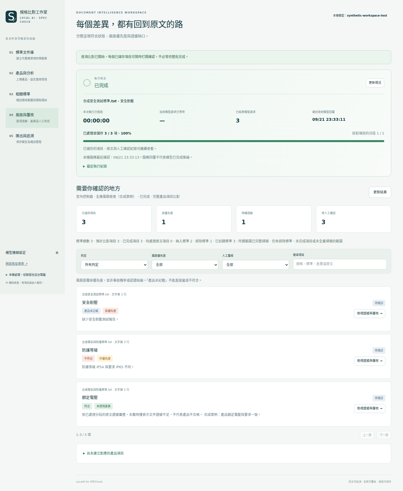

# LocalAIforSPECheck｜本機標準文件庫、規格比對與風險覆核

**v0.3.3：補強小模型的本機原子萃取 Prompt、欄位與漏數值檢查，並提供可重複執行的萃取探針。** 同仁上傳一份產品規格，確認抽取項目與產品用途後，系統對所選文件庫的每份標準做相關性與適用性初篩，再逐項比對人工保留的標準，整理差異、風險覆核優先度及待補證據。產品分析在本機執行，保留原文、人工修改、篩選理由與輸出歷史。

本版將「相關性」「適用性」「符合狀態」「風險覆核優先度」分開呈現。**風險提示是待覆核建議；文件缺少證據不等於產品實際失效，完成處理也不等於完成認證。**

## Windows：程式與模型分開下載

| 下載項目 | 何時需要 | 連結 |
|---|---|---|
| Windows x64 Portable 程式 ZIP | 第一次使用及更新程式 | [下載 ZIP](https://github.com/pcpcchen-coder/LocalAIforSPECheck/releases/latest/download/LocalAIforSPECheck-Windows-x64.zip) |
| Qwen3.5-2B Q6_K 模型，約 1.56 GB | 第一次使用；之後保留並沿用 | [模型獨立下載頁與檢查碼](models/README.md) |
| 發佈資訊與 ZIP 檢查碼 | 核對版本及成品驗證 | [GitHub Releases](https://github.com/pcpcchen-coder/LocalAIforSPECheck/releases) |

**v0.3 起 ZIP 不再含 GGUF 模型。** ZIP 仍包含 Python、全部執行套件、CPU 模型服務與必要 DLL；使用者不需要安裝 Python、LM Studio 或 Bionic。請下載名為 `LocalAIforSPECheck-Windows-x64.zip` 的 Release 附件；`Source code (zip)` 不是可直接執行的套件。

1. 將程式 ZIP **全部解壓縮**到自己可寫入的 Windows 10／11 x64 本機資料夾。
2. 第一次雙擊 **`Download_model.bat`** 下載固定模型並核對檢查碼；或依 [模型下載頁](models/README.md) 手動下載，把完整 `.gguf` 放進 `models`。已有舊版模型可直接複製沿用，不必重抓。
3. 雙擊 **`Start.bat`**，等待模型載入與瀏覽器開啟；保留啟動視窗。
4. 先用少量短文件完成下方流程，再建立大型文件庫。
5. 日後只需 `Start.bat`；完成後使用 **`Stop.bat`**。程式與模型都準備好後，分析、覆核及匯出可離線執行。

若工具電腦不能連網，可在允許下載的電腦取得 ZIP 與 GGUF，依公司允許的方式搬入。完整步驟、更新及排錯見 [Windows 操作指南](docs/WINDOWS_PORTABLE.md)。

## 小模型萃取品質

新版已直接接入 [完整本地 Prompt](spec_check/prompts/LOCAL_ATOMIC_EXTRACTION_PROMPT.md)，提供逐步拆項與正反例；可疑欄位、漏掉的數值與部分條件／例外會保留為待確認。另附 16 個合成案例（22 個預期項目），可用內附 Python 比較不同模型。

[操作、評測命令與驗收限制](docs/LOCAL_EXTRACTION_QUALITY.md)。**尚未宣稱 E4B／12B／Bonsai 達到正式文件品質門檻；引用完整不等於語意完整。** 更新程式後新萃取自動使用新 Prompt，已確認文件不會自動重跑。Windows ZIP 須等對應版本的 CI 驗證與發佈完成；請核對 Release 版本，Source code ZIP 不能取代 Portable。

## 公司不能上傳檔案：在外網整理，再下載成果

**外網 ChatGPT ＋規範連結＋[專用 Prompt](docs/CHATGPT_EXTERNAL_LINK_PROMPT.md) → 下載 `.standard.json` → 文件庫「匯入 ChatGPT 完整成果」→ 預覽 → 人工確認。** 成果可直接帶到另一台電腦，不需要原本的資料庫或萃取包。

文件庫也新增「貼上規範檔案連結」，支援公開 HTTPS 檔案下載；成果可選本機檔或公開成果連結。下載時顯示等待時間與錯誤原因。ChatGPT 對話網址或登入預覽頁不能直接當成檔案網址；改用下載後的成果檔。

詳見 [完整流程、連結限制與操作方式](docs/LINK_IMPORT.md)。外部轉錄的完整性仍須對照原規範核對，partial 成果只能預覽，補齊後才可匯入供產品分析。

**真實文件試用：**[GB 39752-2024 萃取成果與匯入教學](examples/standards/GB39752-2024/README.md)，含可直接匯入的 JSON、離線預覽頁與實測報告。附件 31 頁整理為 172 區塊、498 項；引用資料不足及背景待覆核分開說明，尚未經人工合規簽核。現有 v0.3.2 可用，不需重下載程式或模型。

## 用 ChatGPT 萃取標準，再帶回本機

已確認可外送的標準可使用新流程：**標準文件「查看／確認」→「外部模型萃取（ChatGPT）」→下載萃取包→按包內 Prompt 取得 JSON→預覽並分批匯入→收齊後套用→人工確認**。不用先執行本機標準抽取；產品抽取與比對繼續在本機進行。

- [完整 ChatGPT Prompt](docs/CHATGPT_STANDARD_EXTRACTION_PROMPT.md)：每包也內附 `PROMPT.md`，含拆項、條件／例外、表格、跨章引文、JSON 與長文件規則。
- [逐步操作與錯誤修正](docs/EXTERNAL_EXTRACTION.md)：來源識別碼、逐字引文驗證、分批暫存、重新確認與搬移限制。
- [可讀取的合成範例](examples/external-extraction/README.md)：示意 input／result 格式；正式匯入必須使用自己系統產生的包。

系統只匯出所選標準的來源及資料欄位，由使用者手動交給外部模型；不會自動把產品文件或分析結果上傳。未涵蓋原文保留待處理；格式通過不等於語意正確。

## 每次分析的流程

| 步驟 | 同仁操作 | 系統產出 |
|---|---|---|
| 1. 建立標準文件庫 | 批次匯入標準、抽取、核對來源與獨立要求；補上版本／範圍等資料並確認 | 可重用的標準與項目；未成功抽取的原文保留提示 |
| 2. 準備一份產品 | 上傳產品規格，抽取並確認獨立規格；可修改、拆分項目 | 數值、單位、運算條件、例外、測試方法及原文位置 |
| 3. 全庫初篩 | 填用途、環境、市場等資訊；啟動分析並檢查所有標準的建議 | 逐份列出相關性、適用性、理由及不確定處 |
| 4. 確認範圍並比對 | 所有標準預設保留；人工排除須記錄理由，再開始項目比對 | 逐項判定、產品引文、差異、檢索覆蓋及風險優先度 |
| 5. 覆核與匯出 | 先看高優先度與待補證據，逐筆確認／改判／重新開啟 | HTML／Excel／JSON；保留來源快照、篩選與覆核歷史 |

標準庫可容納多份文件並以分頁使用；**數百份文件的流程驗證不代表數百份真實標準的判斷品質已驗收**。第一次建立文件庫仍需時間抽取與人工確認；之後新產品沿用已確認項目。既有分析使用建立當時的快照，不會因文件庫後續修改而偷偷改變。

### 兩種比對模式

| 模式 | 行為 | 使用時須注意 |
|---|---|---|
| 聚焦比對 `focused` | 先選候選產品原文；高／未知關鍵性或待處理要求掃全文，查無證據會擴大查核 | 可能降低請求量；局部查核不宣告完整符合，保留實際覆蓋與疑義 |
| 全量比對 `exhaustive` | 對保留的標準項目掃描全部產品文字分段 | 較慢；適合提高文字覆蓋及抽核聚焦結果，仍不是語意零漏判保證 |

初篩使用每份標準及產品的代表性摘錄，並非已逐條比對全文；檢索分數也不是適用機率。兩種模式均先處理分析範圍中的每份標準；模型不會自動把「未知」或低相關性文件從分析中消失。排除文件、未確認資訊、未完成比對及證據覆蓋會列在報告。

## 產出如何解讀

| 輸出 | 回答的問題 | 不能替代的判斷 |
|---|---|---|
| 相關標準 | 主題或要求是否可能與產品有關？ | 相關不代表一定適用 |
| 適用性 | 用途、範圍與條件是否支持採用這份標準？ | 仍須核對正式版本及工程／合規判斷 |
| 逐項符合狀態 | 產品文字支持符合、部分符合、不符合、缺證據或待確認？ | 文字證據不等於實體測試 |
| 風險覆核優先度 | 哪些差異或關鍵證據缺口值得先看？ | 不是失效機率、正式 FMEA／RPN 或認證結論 |
| 未對應產品項目 | 哪些產品規格尚未建立對應？ | 不代表所有標準都沒有這項要求 |

「缺少資料」「模型輸出不可靠」「檢索未涵蓋全文」應保留為待確認或證據缺口。原文引述驗證只確認文字存在；是否引用了正確型號、條件及測試方法仍需人工確認。

## 介面示例

以下使用合成文件與受控測試回覆，展示結果與人工覆核流程，不是公司文件或模型準確率成績。



[查看逐項原文與人工覆核畫面](docs/screenshots/workspace-review.png)

## 舊版資料與更新

新入口 `/` 使用文件庫與項目流程；**`/classic` 保留 v0.2 的專案、逐區塊比對與歷次覆核**。在「標準文件庫」按 **「匯入舊版專案文件」**，選擇舊專案，即可沿用已保存的產品與標準原檔，不必逐份重新上傳。新匯入文件需完成獨立項目抽取與確認；相同內容及文件角色已在新版庫時會直接重用。舊資料不會被自動當成已確認的獨立規格項目。舊版的文件符合度分數仍只屬於舊流程，不能當作新流程的相關性或風險排序。

先 `Stop.bat`，備份舊版，再把新 ZIP 解壓到新資料夾；將舊版完整 **`data` 與 `models`** 複製過去。模型不隨新版 ZIP 重複下載。詳見 [更新、備份與搬移](docs/WINDOWS_PORTABLE.md#更新備份與搬移)。

## 原始碼與既有模型服務

開發者需要 Python 3.11+。Windows 一般同仁使用 Portable 即可，不必執行下列指令。

```bash
git clone https://github.com/pcpcchen-coder/LocalAIforSPECheck.git
cd LocalAIforSPECheck
python -m venv .venv
```

Windows：

```bat
.venv\Scripts\python.exe -m pip install -r requirements.txt
.venv\Scripts\python.exe launcher.py
```

macOS／Linux：

```bash
.venv/bin/python -m pip install -r requirements.txt
.venv/bin/python launcher.py
```

在模型設定填入同機 OpenAI 相容 API，例如 LM Studio 的 `http://127.0.0.1:1234/v1`，以實際端口及 `/models` 回傳的模型 ID 為準。Bionic 是否提供可供本工具使用的 API，需在該版本環境確認。模型選擇、JSON 格式需求與測試方法見 [MODELS.md](docs/MODELS.md)。

服務只綁定 `127.0.0.1` 且使用單一 worker；不支援以此版本直接架設多人共用網站。工作資料預設在 `data`，可設定 `SPEC_CHECK_DATA`。備份須包含整個資料目錄；JSON 報告沒有一鍵匯回續作功能。

## 限制與驗收

- 支援有文字層的 PDF、DOCX、XLSX、CSV、TXT、Markdown，單檔上限 30 MB；沒有內建 OCR。
- 圖片、跨頁表格、公式及註脚可能未完整擷取；須先核對來源，再確認項目。抽取完成不是原子條件完整性的證明。
- 入門 2B 模型適合測試操作與初篩；複雜條件應用代表性人工答案評估模型，不以參數量或成功 JSON 回覆代替驗收。
- 風險優先度採可檢查的提示規則與模型／人工標註，沒有工業失效資料校準；關鍵性未知不能解讀為低風險。
- 覆核姓名為自填；歷史與檢查碼便於追溯，並非數位簽章或不可竄改憑證。
- 初篩與比對循序載入標準；完整匯出仍一次彙整全部快照，數百份長標準的記憶體與輸出大小需在目標電腦實測。
- 本版不宣稱已在公司真實標準庫達成準確率、召回率或固定完成時間；實際證據見 [測試報告](docs/TEST_REPORT.md)。

```bash
python -m pip install -r requirements-dev.txt
python -m pytest
```

| 文件 | 用途 |
|---|---|
| [同仁操作指南](docs/USER_GUIDE.md) | 建庫、抽取確認、篩選、比對、覆核與輸出 |
| [Windows Portable](docs/WINDOWS_PORTABLE.md) | 下載、離線啟用、沿用模型與排錯 |
| [模型下載頁](models/README.md) | 固定 GGUF 連結、大小、SHA-256 |
| [模型與連線設定](docs/MODELS.md) | LM Studio／Bionic 及模型選型限制 |
| [架構](docs/ARCHITECTURE.md) · [v0.3 API](docs/API_V03.md) | 模組、資料流、接口與相容性 |
| [驗收清單](docs/ACCEPTANCE.md) · [評估方法](docs/EVALUATION.md) | 真實資料與人工答案的驗收方法 |
| [測試報告](docs/TEST_REPORT.md) | 實際已執行的檢查與限制 |
| [封裝重建](docs/BUILD_PORTABLE.md) · [元件來源](docs/PORTABLE_COMPONENTS.md) | 固定版本、授權及成品驗證 |
| [安全與資料](docs/SECURITY.md) | 單機邊界、機密資料及備份 |
