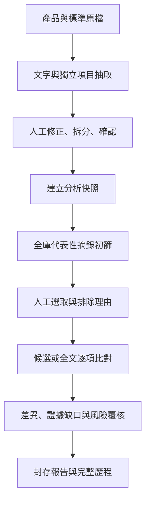

# 架構與維護

## 執行組成與入口

Python 3.11+、FastAPI、SQLite 與無 CDN 的 HTML／CSS／JavaScript。應用程式與模型服務綁定同機 loopback；使用單一 Uvicorn worker。Portable 內附 Python、CPU llama.cpp 及依賴；GGUF 由獨立下載步驟放進 `models`。

- `/`：v0.3 文件庫、獨立項目、全庫初篩、逐項比對及風險覆核。
- `/classic`：v0.2 專案、逐區塊比對及既有歷史。
- `/api/v2`：新版 API；完整欄位見 [API_V03.md](API_V03.md)。原有 API 保留。

不需要雲端帳號、向量資料庫或額外 embedding 模型。候選檢索使用本地詞彙特徵；相關性與適用性判讀使用同一個本機語言模型。

## 主要模組與資料

| 模組／位置 | 責任 |
|---|---|
| `spec_check/app.py` | 應用入口、舊 API、共用模型設定及本機安全邊界 |
| `spec_check/workflows.py` | 新版文件庫 API、背景抽取／初篩／比對工作及恢復 |
| `spec_check/storage.py` | SQLite、快照、版本控制及覆核事件 |
| `spec_check/ingestion.py` | 原檔解析、文字區塊、位置與限制警告 |
| `spec_check/analysis_engine.py` | 獨立項目抽取、來源保留、相關性初篩、檢索、逐項判讀與風險規則 |
| `spec_check/engine.py` | 共用本機模型連線、舊比對、引文驗證 |
| `spec_check/exports.py` | 新舊 HTML／XLSX／JSON 報告 |
| `spec_check/static/workspace.*` | 新文件庫及風險覆核介面 |
| `spec_check/static/app.js` | 舊版專案介面 |
| `portable/launcher.py` | 私有 Python／模型服務啟停、資料夾鎖、模型指紋 |
| `portable/download_model.py` | 固定模型下載／離線匯入與雜湊驗證 |
| `data/` | 執行時文件庫、產品、原始附件、分析、覆核及封存報告，不得提交 Git |

新版與舊版共用工作資料目錄。`POST /api/v2/import-project` 可由舊專案建立新版產品／標準紀錄，沿用原始附件與文字，依 SHA-256 與文件角色重用既有新版文件；保存舊專案及文件來源 ID，舊比對與覆核不改寫。新匯入文件狀態為未抽取／未確認；不將舊原文確認冒充獨立項目確認。缺少原始附件時拒絕匯入，示範專案不進正式文件庫。`SPEC_CHECK_DATA` 可指定資料位置。所有清單使用分頁，詳細原文按需讀取。

## 1. 原文擷取、項目抽取與確認

原檔保存 SHA-256，解析成帶位置的文字區塊。模型按來源區塊抽取 `requirement`、`specification`、`context` 或 `unresolved` 項目，保存參數、值、單位、運算關係、條件、例外、測試方法、關鍵性及依據。

抽取結果必須有可驗證的來源引文。格式錯誤、引用不存在或模型未處理的非空白原文不會被捨棄，會保留為 `unresolved`。數值／應然要求被誤列為純背景時，也有保守處理。背景項目不作為產品必須通過的要求，但保留在文件及報告。

**來源字元有被引文保留，不等於語意上的獨立要求都已抽出。** 同一句內的多條件、否定、例外及跨章定義仍可能漏判；使用者必須核對並可編輯／拆分。變更採文件版本檢查，保留前後項目與人工紀錄，重新要求確認，不修改既有分析快照。

確認文件可以明確知悉仍有未解析警告，不能把確認動作解讀為所有疑義已解決。標準抽取保存在全域文件庫，供不同產品重用；重新分析無需每次重抽已確認標準。

## 2. 全庫初篩與人工選取

建立分析時，在單一交易中逐份保存產品、所選標準、項目、抽取歷史、非機密模型設定及產品情境快照；不先把整個標準庫的全文集中於記憶體。初篩與比對工作者保留產品與目前這一份標準，循序載入下一份。對每份標準分別送出初篩請求：產品與標準各有有界文字預算，以標題、範圍及詞彙檢索挑選代表性摘錄。此步驟涵蓋每份文件，但不是逐條全文判讀。

本地檢索使用英文詞彙及中文字元二元組等特徵；`relevance_score` 是檢索排序分數，並非機率、模型校準信心或符合度。模型另回傳 relevance、applicability、理由、證據及警告。

所有標準起始 `selected=true`。即使模型判 `not_applicable` 或請求失敗，也不能自動從比對範圍排除；使用者排除須提供理由，記錄覆核者與版本。這減少由自動初篩直接造成靜默遺漏的風險，並不消除人工篩選錯誤。

## 3. 逐項比對與覆蓋

| 模式／條件 | 證據來源策略 |
|---|---|
| `focused`，一般項目 | 預設檢索最多 12 個原始產品文字區塊，再按上下文預算分窗 |
| 高關鍵性、關鍵性未知、未解析項目 | 強制掃描全部原始產品文字區塊 |
| 候選中找不到證據／回覆未載明 | 擴大至全來源檢查，避免只因檢索沒找到便宣布缺資料 |
| `exhaustive` | 每個被選標準項目都使用全部原始產品文字區塊 |

證據用原始產品區塊，並非僅依賴模型抽出的產品項目，因此抽取遺漏不會直接把來源從全文查核刪除。候選對應也建立 `matched_product_item_ids`，用於顯示未對應產品項目。

模型提示要求比較相同參數、適用條件、例外、測試方法及等價單位；**本版沒有獨立的確定性單位換算引擎**。所有肯定／衝突結論須有有效引用；引文存在只證明引用位置有效，不證明語意判斷正確。

`retrieval` 記錄候選與總來源區塊數、模式及 complete；另保留每次實際文字視窗的處理資訊。只檢查候選時不得宣告全文件符合或完整未載明，風險亦保留覆蓋不足。即使數量顯示完整，也只是來源處理範圍，不是語意召回率。

分析層級分開記錄兩種完整性：

| 欄位 | 定義 |
|---|---|
| `coverage.selected_scope_complete` | 分析已完成，選取範圍的所有要求都有結果，且每列均已完整掃描產品來源 |
| `coverage.coverage_complete` | 上述條件成立，而且本次分析沒有排除任何標準 |
| `coverage.unresolved_items` | 建立分析時，產品與標準快照中仍未解析的項目數；完成掃描不會自動把它歸零 |

未對應產品清單使用較嚴格的 `coverage_complete`。即使所有保留標準都比對完成，只要有人工排除文件，就不能呈現整個分析範圍已完整覆蓋。上述欄位都不表示語意完整或適用性已認證。

已排除標準、模型失敗、未完成項目、未解析來源與篩選摘錄限制都應顯示。未對應產品清單只代表尚未建立對應，不能當成所有標準都沒有相應要求的證明。

## 4. 符合狀態與風險規則

| 判定 | 風險類型與解讀 |
|---|---|
| `mismatch`／`partial` | 有差異，類型為不符合／部分符合提示；優先度參照項目關鍵性 |
| `missing` | `evidence_gap`；提示補證據，不宣告實體失效 |
| `uncertain` | `uncertainty`；保留判讀不足原因，未知不能當成低風險 |
| 全量有效 `match` | 當前項目未發現差異；不代表產品整體符合所有標準 |

風險欄位保存類型、level、理由及關鍵性依據；同時保留原 AI 風險與人工覆核後的有效風險。這是覆核工作優先度，未使用真實事故機率、失效後果統計或正式 FMEA／RPN 計算。

## 5. 背景工作、現況與中斷恢復

分析狀態為 queued、screening、awaiting_selection、comparing、completed、cancelled、interrupted、failed。抽取等 job 為 queued、running、completed、cancelled、interrupted、failed；欄位見 API 文件。

每完成一個可保存工作單位即持久化，取消於模型呼叫邊界生效。重啟後未完成工作標示中斷；續跑保留快照與已完成項目，不混入目前文件庫的新版本。換模型重評應建立新分析；Portable 模型指紋及本機新埠的相容性依啟動器／API 驗證處理。

進度包含階段、工作位置、請求起始、最近實際回覆、完成請求數及近期事件。前端計時只是時間差，非模型心跳；狀態輪詢只證明應用 API 可回應。輕量摘要不應每次重傳全部原文、結果與歷史。

`completed` 表示流程已處理完，可能仍有待確認及模型失敗結果；不是所有要求已人工確認。舊版保留 `GET /api/runs/{id}/progress`，缺少新欄位的舊紀錄不補造歷史。

## 6. 覆核、匯出與稽核

項目修改、文件確認、選取／排除及結果覆核均保存紀錄。結果覆核使用 `expected_version` 防止頁籤間覆寫；衝突回傳 409。更正判定、調整風險與重新開啟必須理由，原始模型判定保留。

新版快照 `schema_version:2, kind:"analysis"`，包含 documents、results、screenings、product_extras、audit、coverage、counts 與 execution_jobs。抽取文件保存當時模型 SHA-256；execution_jobs 保留執行模型指紋及續跑紀錄，適用於由 Portable 提供可驗證 GGUF 的工作。HTML／XLSX／JSON 同時呈現來源、初篩、差異、待補證據、產品未對應項目與歷程，詳見 [API_V03.md](API_V03.md)。

每次匯出保存於 reports，記錄時間、格式及 SHA-256；下載歷史匯出取得原來 bytes，不因後續覆核變更。API key 不進入匯出。JSON 是分析快照，不能替代含原始附件的完整資料目錄備份。

完整報告刻意包含所有文件及項目快照；目前匯出會一次組合整份分析，因此大量長標準可能造成較高記憶體用量與較大檔案。這與初篩／比對逐份載入的工作者不同；尚未實作串流匯出，不保證任意規模文件庫都能在低記憶體電腦一次匯出。

覆核者姓名由人員自填，SQLite 擁有者可直接修改檔案；追加歷史及 SHA-256 不是數位簽章或防竄改保證。

## 安全與維護界線

本機 OpenAI 相容 API 使用 `/models` 與 `/chat/completions`，停用環境 proxy 及重導向。模型無 shell、瀏覽器或外部工具，文件指令視為資料。前端與報告轉義 HTML，Excel 防止文件內容成為公式。

不要增加 Uvicorn workers 或使用 `--reload`；目前排程與取消控制以單程序工作站為邊界。多人共用需另設登入、權限、跨程序佇列、模型排程及正式稽核，不能只把 host 改成 `0.0.0.0`。

舊流程與 v0.3 的評估單位不同：舊版是一個文字區塊一列，新版是抽取並可人工拆分的獨立項目。不得直接把兩者的數量與符合率當作等價品質指標。

## 手動外部萃取交換

`external_extraction.py` 管理 standard-only 萃取包、固定 Prompt、JSON schema、批次預覽、保存與套用；不呼叫雲端服務。`v2_external_package` 保存來源雜湊、Prompt 雜湊、文件基準版本及批次 manifest；`v2_external_batch` 暫存每批驗證後項目及內容雜湊。未收齊時不改文件 index；收齊後以同一交易建立新 `v2_item` index、更新文件與新增 audit。文件版本或原文改變即禁止舊包套用，套用清除舊 job_id，避免恢復舊抽取工作覆蓋新版。

`context_evidence` 保存同文件跨章引文；本機比對優先讀取這些來源區塊，仍遵守上下文預算與保守判定。來源快照、JSON 報告與抽取歷程保留 external_source、操作者填報模型及雜湊。這些識別碼綁定原資料庫，不是任意文件之間的模糊對應。

## 規範 URL 與完整成果（v0.3.2）

`link_import.py` 使用標準庫實作受限 HTTPS 下載，DNS 每跳核對後固定 IP 至 TLS；`/library/link` 交由既有 upload／parser 去重。前端仍 connect-src self；公開下載由本機後端執行，不鬆綁本機模型 URL 規則。

`standard_package.py` 支援 `local-specheck-standard-package`：自带 standard metadata、coverage、原文 blocks 與 items，不依賴舊資料庫識別碼。重用外部萃取的逐字引文／上下文／未涵蓋片段驗證；preview 不寫入，import 指紋核對後原子新增 ready、confirmed=false 文件及項目／audit，原始 JSON 以 UUID 儲存。external_content_sha256 去重，source_kind=external_transcription 明確標示轉錄來源；partial 不能確認。source_url 僅為資料，不觸發下載。快照沿用現有文件／項目複製機制。
