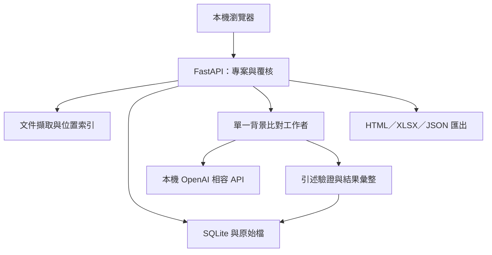

# 架構與維護

## 執行組成



前端為不依賴外部 CDN 的 HTML／CSS／JavaScript；後端為 Python 3.11+、FastAPI 與標準函式庫 SQLite。啟動器固定綁定 `127.0.0.1`，預設端口 `8765`，單一 Uvicorn worker。模型 server 是獨立程式，與本工具在同機執行。

本版不需要向量資料庫、embedding 模型、GPU Python 套件或雲端帳號。選擇完整掃描產品文字視窗，以免單靠檢索 top-K 排除重要的反例或例外條件。代價是模型呼叫量與處理時間較高。

## 目錄

```text
LocalAIforSPECheck/
  launcher.py                 本機啟動、健康檢查與開啟瀏覽器
  start_windows.bat           Windows 雙擊入口
  start_macos.command         macOS 雙擊入口
  start_linux.sh              Linux 入口
  requirements.txt            執行依賴
  requirements-dev.txt        測試依賴
  spec_check/
    app.py                    HTTP API、背景工作與安全邊界
    storage.py                SQLite、覆核事件與版本控制
    ingestion.py              文件擷取、位置與警告
    engine.py                 本機 API、提示詞、證據驗證與計分
    exports.py                HTML／XLSX／JSON 報告
    static/                   無外部資源的瀏覽器介面
  docs/                       操作、模型、架構、安全與驗收文件
  examples/                   人工合成的產品／規範文字範例
  tests/                      自動測試
  data/                       執行時建立，禁止提交到版本控制
```

資料根目錄可由 `SPEC_CHECK_DATA` 設定。啟動器會切換到程式根目錄，因此雙擊啟動時不依賴終端機原本所在路徑。

## 從文件到結果

1. 上傳時保存原檔，產生 SHA-256，提取有位置的文字區塊。區塊過長時分割，不默默截斷。
2. 每份文件先提供擷取預覽與格式限制提醒，使用者明確確認後才可開始正式比對。
3. 新比對保存文件快照、非機密模型設定、提示詞版本與 SHA-256；後續上傳或移除文件，不改變舊比對的來源。
4. 每個規範區塊逐一對照全部產品文字視窗，提示模型列出複合條件中的差異，並提供產品區塊 ID、原文引述與位置。
5. 驗證模型回傳結構，以及引述在所指產品區塊中是否存在；無有效引述不能判為符合、部分符合或不符合。
6. 根據各視窗判定及警告彙整成一列，保存來源、證據、產品覆蓋資訊與 AI 判定。
7. 每完成一列即寫入資料庫。顯示排序時使用有效人工判定；原始 AI 結果與覆核歷史仍保留。

`product_coverage` 是文字掃描進度，不是工程要求的語意召回率。來源快照保留文字及位置，原始二進位文件仍在 uploads。只匯出 JSON 不等於已備份全部原始檔。

每次匯出另存於工作資料目錄的 reports，並記錄匯出 ID、格式、時間與檔案 SHA-256。歷次下載使用當時保存的檔案，不重新產生；再次匯出才會反映最新的人工覆核。

## 模型介面

使用 OpenAI 相容的 `/models` 與 `/chat/completions` 介面。模型設定包括 `base_url`、`model`、API key、temperature、max_tokens、timeout、context_chars 與 structured_output。

- URL 只接受 loopback 主機，停用環境 proxy 與 HTTP redirect，避免模型請求被轉送到外部。
- API key 可存於本機設定，但不回傳給前端查詢，也不保存到 Run 設定與匯出。
- structured_output 需要服務支援；關閉後仍需要模型產出可解析的 JSON。無法解析應標記待確認，而不是視為合規。
- 文件內容在提示中被視為資料；模型不會取得 shell、瀏覽器、檔案寫入或其他 agent 工具。

模型及 context 設定應在啟動比對前固定。續跑採該次原設定，以目前本機保存的 API key 連線。若要換模型、修正已完成的模型失敗列或比較不同設定，建立新的 Run。

## 工作狀態與恢復

| 狀態 | 含義 |
|---|---|
| queued | 已建立、等待背景工作者 |
| running | 正在處理 |
| completed | 所有規範區塊均已有結果；可能仍包含待確認或模型錯誤列 |
| cancelled | 使用者停止；可續跑未完成列 |
| interrupted | 上次服務停止時尚未完成；重啟標記後可續跑 |
| failed | 工作層級異常中斷；已有結果仍保留，可嘗試續跑 |

背景工作者循序處理，不使用多程序分配同一資料庫中的工作。取消旗標會在模型呼叫之間檢查；正進行的 HTTP 請求可能需等待 timeout。未完成的規範列不當作完整結果保存，續跑時重做該列，已保存列不重複執行。

比較 API 失敗通常會產生 `uncertain` 結果，讓標準區塊不會消失；一個 Run 顯示 completed 只表示系統流程結束，不表示全部要求已確認。

## 覆核資料與計分

每個結果有不變的 AI 判定，以及可變的目前人工覆核狀態。每次覆核追加一筆事件，包含 decision、final_status、reviewer、note、UTC 時間與 version。

- `confirmed`：確認原 AI 判定。
- `changed`：必須提供最終狀態與更正理由。
- `reopened`：必須提供原因，回到待覆核；計分恢復使用 AI 判定。
- 寫入需提供 `expected_version`。版本已變更則回覆 HTTP 409，避免兩個頁籤互相覆寫。

重播歷史時依版本順序還原事件。事件的追加性由應用程式維護，並非區塊鏈、數位簽章或防竄改儲存；資料庫檔案所有者仍可修改內容。

文件符合度參考分數 = `100 × (match + 0.5 × partial) / 規範區塊總數`。已確認／已更正採人工最終狀態；其餘採 AI 判定。缺資料、待確認及未完成區塊不從分母移除。排序供工作優先順序參考，沒有條款重要性權重。

## 主要 API

| 方法與路徑 | 行為 |
|---|---|
| `GET /api/health` | 回傳 status、version、app 識別，啟動器據以避免重複開啟 |
| `GET/PUT /api/settings` | 查詢或更新本機模型設定；不回傳 API key |
| `POST /api/connection` | 測試模型清單；不代替實際推論驗證 |
| `GET/POST /api/projects` | 專案列表與建立 |
| `GET /api/projects/{id}` | 專案及目前文件 |
| `POST /api/projects/{id}/documents` | multipart 上傳 file 與 role |
| `POST /api/projects/{id}/documents/{docid}/confirm` | 確認擷取 |
| `DELETE /api/projects/{id}/documents/{docid}` | 移出專案，保留原檔及歷史比對 |
| `GET /api/projects/{id}/documents/{docid}/original` | 下載原始文件 |
| `POST /api/demo` | 建立合成示範專案，不呼叫模型 |
| `POST /api/projects/{id}/runs` | 建立 local 或 demo 比對 |
| `GET /api/projects/{id}/runs` | 專案比對歷史 |
| `GET /api/runs/{id}` | 完整結果、排序與覆核歷史 |
| `POST /api/runs/{id}/cancel` | 請求停止 |
| `POST /api/runs/{id}/resume` | 續跑未完成區塊 |
| `POST /api/results/{id}/reviews` | 追加覆核事件，檢查 expected_version |
| `GET /api/runs/{id}/export?format=html` | 匯出，也支援 xlsx、json |
| `GET /api/runs/{id}/exports` | 歷次匯出紀錄與檔案 SHA-256 |
| `GET /api/exports/{id}/download` | 下載指定匯出當時的封存原檔 |

欄位細節見 [CONTRACT.md](../CONTRACT.md)。時間儲存為 UTC ISO 8601。錯誤回傳 `{ "detail": "訊息" }`。

## 維護注意

不要把 worker 增至多個，也不要開 `--reload`；目前工作排程與取消旗標位於單一程序。若要多人共用，需先另行設計登入、權限、身份驗證、TLS、跨程序工作佇列、模型排程、資料庫遷移及稽核不可竄改機制。

從介面移除文件只是邏輯移除，方便版本更換且保留歷史。需要依政策徹底清除時，應在停止程式後處理專用工作資料夾及其備份，不能把畫面的「移除」視為安全刪除。
