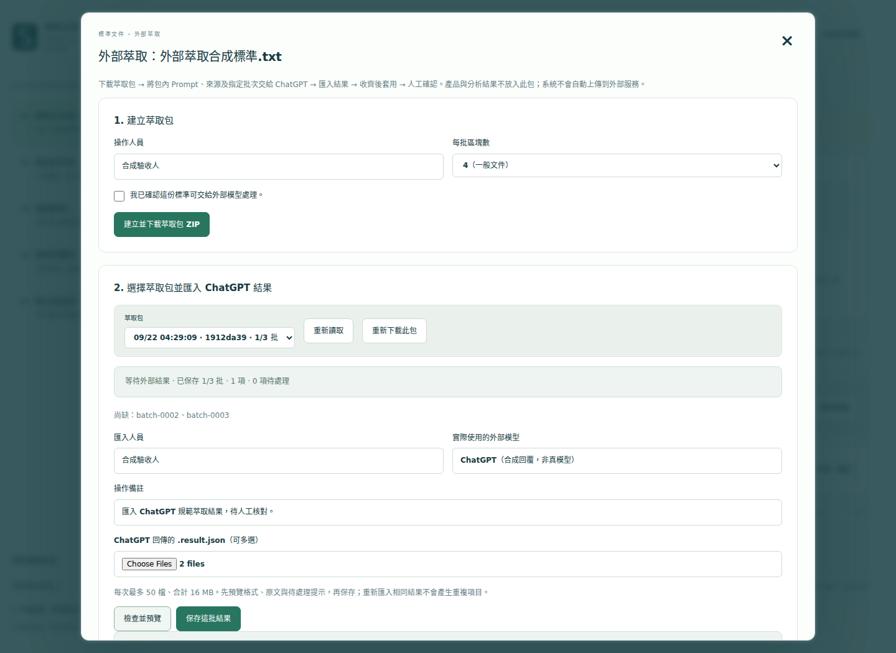

# 用 ChatGPT 萃取規範，再匯入本機系統

適用 v0.3.1 以上。此流程讓外部模型處理你已確認可外送的標準文件；產品規格、相關性初篩與產品比對仍使用本機模型。標準整理好後可以重複供不同產品使用。

**完整 Prompt：[CHATGPT_STANDARD_EXTRACTION_PROMPT.md](CHATGPT_STANDARD_EXTRACTION_PROMPT.md)**。每個系統匯出的萃取包也內附相同內容的 `PROMPT.md`，不需要自行設計 JSON。

## 1. 先在系統準備標準

1. 更新到 [最新 Windows Portable](https://github.com/pcpcchen-coder/LocalAIforSPECheck/releases/latest)，沿用原有 `data`、`models`。更新方法見 [Windows 指南](WINDOWS_PORTABLE.md#更新備份與搬移)。
2. 開啟「標準文件庫」，上傳標準；已有文件就開啟該文件的「查看／確認」。**不必先執行本機項目抽取。**
3. 先看來源原文是否完整。若有掃描頁、圖、公式或錯位表格，須先處理文字解析問題；外部模型回覆不能補回系統從未取得的原文證據。
4. 如需補標準版本、範圍、地區，先完成修改；再按 **「外部模型萃取（ChatGPT）」**。
5. 填操作人員，確認該份標準可以交給外部模型，按 **「建立並下載萃取包 ZIP」**。

預設每批 4 個系統原文區塊，密集條文可選 1；這是輸出長度的控制，不是把一個區塊當成一個規格。ChatGPT 還要把每個區塊拆成多個可獨立確認的要求。每個區塊最多可輸出 200 項。

包內檔案：

| 檔案 | 用途 |
|---|---|
| `PROMPT.md` | 完整萃取命令，可直接複製貼上 |
| `source.json` | 該份規範的已解析全文、來源位置及識別碼，供跨章條件核對 |
| `result.schema.json` | 固定輸出結構 |
| `batch-0001.input.json` 等 | 各批指定要處理的原文及鄰近上下文 |
| `README.txt` | 簡短操作提醒 |

包內只取所選標準的來源與 metadata；不包含產品清單、分析結果、覆核歷史、API 金鑰。系統沒有連到 ChatGPT 的上傳功能，由你手動選擇附件。請不要把整個 `data` 資料夾交給外部模型。

## 2. 在 ChatGPT 執行

建議一份規範開一段對話，避免混用版本／批次。使用你帳號中能讀取附件、產生檔案的模式；若介面無法產生下載附件，Prompt 也提供回傳純 JSON 的替代方法。文件抽取是 ChatGPT 的檔案使用方式之一；支援項目、額度及限制依實際帳號為準，參閱 [OpenAI 檔案上傳說明](https://help.openai.com/en/articles/8555545-file-uploads-faq)。

1. 解壓萃取包。
2. 將 `PROMPT.md` 的全部內容貼到對話。
3. 附上 `source.json`、`result.schema.json` 和這輪的 `batch-0001.input.json`。必要時加上同份原始 PDF 幫助理解排版；引文仍以系統 source 為核對基準。
4. 在 Prompt 後加上：

```text
這輪請處理 batch-0001.input.json。
請讀取 source.json 查核適用範圍、定義、表頭、註腳與跨章條件。
完成後產生可下载的 batch-0001.result.json；用程式重新解析 JSON，
並檢查每個主引文與 context_evidence 是否逐字存在於指定來源區塊。
不可用程式的單純切段代替逐項語意萃取，不要只交摘要或 Markdown 表格。
```

5. 下載 `.result.json`。若只有 JSON 文字，複製完整內容，用記事本另存 UTF-8、檔名 `batch-0001.result.json`；存檔類型選「所有檔案」，避免變成 `.json.txt`。
6. 接著附上下一批 input：

```text
沿用同一份 source.json、schema 與萃取規則，接著只處理 batch-0002.input.json。
產生獨立的 batch-0002.result.json。不要重新輸出或改動已完成的其他批次。
```

也可在一次對話附上數批 input，要求「每批各產生一個 JSON」，但一次先做一批較容易確認。不要一次要求數百份標準在同一個長回覆中全部完成。換新对話時要重新附來源、schema、Prompt 與本輪 input；不要假設模型記得之前的檔案。

如果附件 JSON 被介面拒收，可改以 UTF-8 `.txt` 副本提供相同內容，並告知原檔名；回傳結果仍保存為 `.json`，內容不能修改識別碼。

## 3. 匯入 ChatGPT 結果

1. 回到**原本同一套資料庫、同一份標準**的「外部模型萃取」。
2. 在萃取包清單選擇與結果對應的那一包。不要重新按「建立」，否則會得到不同的 package_id。
3. 填匯入人員、實際外部模型名稱與備註。若不知道模型版本，填 `ChatGPT（版本未知）`，不要猜。此欄是操作者填報，不是系統驗證模型身分。
4. 選取回傳的 JSON，可多選；每次最多 50 檔、合計 16 MB。
5. 按 **「檢查並預覽」**，核對批次數、項目數、待處理數、引文與提示，再按 **「保存這批結果」**。
6. 可以關閉頁面或程式，下次繼續收剩餘批次。畫面會顯示已收數量及尚缺批次。**此階段不改變既有文件項目。**
7. 全部收齊後，勾選確認，再按 **「套用全部結果，返回人工確認」**。
8. 逐項確認數值、單位、條件、例外、試驗方法、跨章引文與待處理項目；必要時修改／拆分。最後按既有的 **「確認此份文件」**。

之後照原流程上傳產品、由本機模型抽取產品規格、全庫初篩與比對。**不要再次按「重新抽取項目」來啟用外部結果**，該按鈕會重新呼叫本機模型建立另一版。



## 4. 系統會檢查什麼

| 檢查 | 行為 |
|---|---|
| 文件／包／批次識別碼及原檔 SHA-256 | 不符即拒絕，避免把 A 規範貼到 B 規範 |
| JSON 結構、重複欄位、欄位型別與批次完整性 | 拒絕截斷、多列、少列與重複區塊 |
| 主要引文與跨章引文 | 必須逐字、連續存在於同份標準指定區塊 |
| 有原文未被任何項目引文涵蓋 | 自動保留成「待處理原文」 |
| 被標成背景但有數字或要求用語 | 保守改成待處理，請人工確認；因此章節編號也可能觸發 |
| 相同批次、相同內容與模型標籤再匯入 | 沿用，不新增重複項目 |
| 同批新結果或模型標籤修正 | 預覽會指出取代批次，保存時留下雜湊與操作者紀錄 |
| 檔案或填寫資料在預覽後改動 | 要求重新預覽 |
| 萃取包建立後文件／項目被改動或確認 | 禁止舊包套用，以保留人工修改；請建立新包 |
| 全部批次套用 | 新 index、清除文件確認狀態；既有分析快照保持原狀 |

「所有文字都有引用」只能證明文字保留，不能證明所有要求都拆得正確。即使引文完全正確，ChatGPT 仍可能誤讀條件、單位或規範強制程度。系統不會因為來源是較大的外部模型就自動確認。

跨章引文會顯示在項目中，也優先提供給本機比對的標準上下文；上下文仍受本機模型容量限制，過長時會保留覆核提示。人工修改項目時保留原抽取參照與外部來源身分，修改前後另留歷史。

## 5. 常見問題與修正命令

**引文不符、JSON 不完整：**將系統錯誤訊息與該批 input、source、原結果交回同一對話：

```text
本機匯入驗證失敗，錯誤如下：
【貼上錯誤訊息】
請依 source.json 與這一批 input 修正，只重交該批完整 .result.json。
不要修改 package_id、document_id、source_sha256 或 batch_id。
不要用模糊配對、改写原文、刪掉整個區塊的方式規避驗證。
若要求無法可靠解析，保留真實原文為 unresolved 並說明待確認原因。
```

**單批太長：**用每批 1 區塊建立新包，依新 input 重做；不同包結果不能混用。若個別區塊超過 200 項，先把原始標準拆成較小檔案、核對來源後重新匯入。

**掃描 PDF／圖片表格：**目前本機沒有 OCR。先由 OCR 工具或外部模型轉成帶頁码、章節、表頭、註腳的文字／Markdown，再作為新來源上傳並核對；保留原始 PDF 作人工參照。圖中的文字如果不在 system source，就不能當作通過原文驗證的引文。

**原始文件重新上傳到另一套系統：**目前 package_id、document_id 綁定原資料庫，JSON 不是跨資料庫的通用匯入檔。要搬整個文件庫，停止程式並搬完整 `data`；只帶 JSON 時需在目的端建立新包並重新產生對應結果。

**同批修正後想保留前一次輸出：**請保留 ChatGPT 原始 JSON 檔。資料庫保存目前驗證後項目、原始檔／正規化內容 SHA-256、替換雜湊與操作歷程，不保存 ChatGPT 對話，也不保存每次上傳檔案的原始位元組。

**只想處理規範、不想開本機模型：**外部萃取 API 本身不呼叫任何模型；現有 Portable 的 `Start.bat` 仍一起啟動本機模型，供後續產品抽取及比對使用。

## 6. 人工驗收要點

先用一份含數值範圍、例外、表格、跨章試驗條件的短規範實測：

- 不漏必須／不得／建議要求；否定與等號方向正確。
- 一項一個可核對要求，保留表頭、型號、前置條件及註腳。
- 數值／單位沒有擅自換算，工作條件與試驗條件不混用。
- 來源區塊、位置和主／上下文引文能回查；無法解析的內容保持待處理。
- 所有批次完成後套用，再由人工確認；用本機產品測試比對及匯出。

這個功能驗證的是交換格式、來源對應、保存及流程。真實 ChatGPT 萃取品質仍需要用你們的文件及人工答案驗收。
